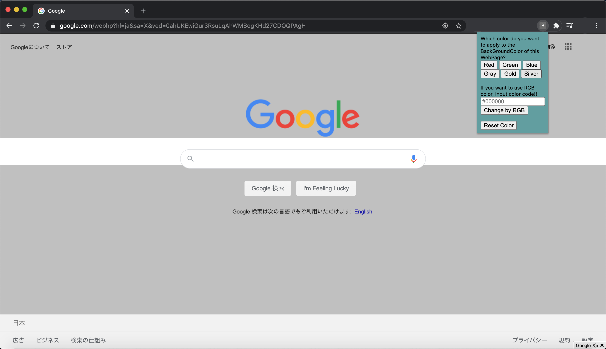
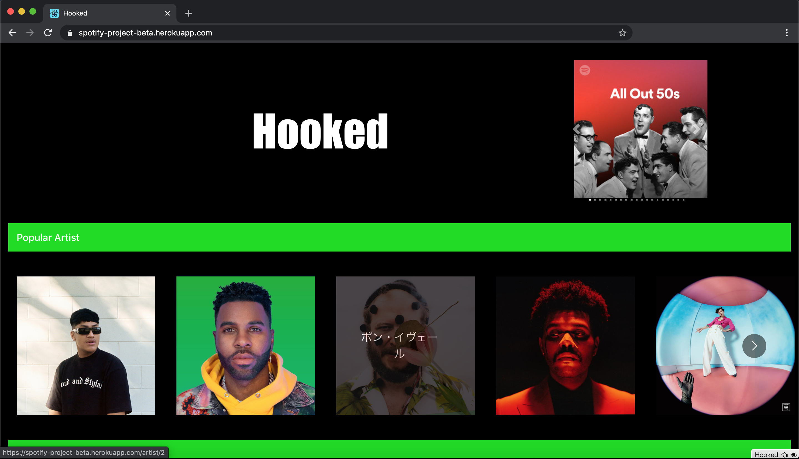

# 職務経歴書

## 基本情報

|      |                      |
| ---- | -------------------- |
| Name | 小川　翔 (Ogawa Sho) |

## 職務経歴

### CodeChysalis 日本語イマーシブ 受講生 (2020/05~2020/07)

- JavaScript を中心にフロントエンドからバックエンドまで幅広く学習する。
  - NodeJS,Express.JS を用いたサーバーの構築
  - ExpressJS を用いた RESTFulAPI の構築。
  - React、Vue を用いたフロントエンド UI の構築。
- 短期間でフルスタックで Web アプリの開発。
  - 2 日間で NodeJS、ExpressJS, ReactJS、KnexJS, Postgres を用いた体調管理 Web アプリを開発。
- SpotifyAPI を用いた Web アプリの開発。
  - 3 日間で SpotifyAPI について学習し、Web アプリを開発、Heroku にデプロイした。
- 短期間で Python を学習し、アプリを開発。
  - 1 週間で Python を学習し、ライブラリを用いたゲームを開発した。
- 最終プロジェクトではバックエンドエンジニアとして AWS を用いた Web アプリの環境構築を行う。
  - EC2 インスタンスの立ち上げ、仮想サーバー環境の構築。
  - CodeDeploy を用いた GitHub と連携した自動デプロイ環境の構築。
  - CodePilepine を用いた継続的インテグレーション環境の構築。
  - SystemManager の ParameterStore をを用いた環境変数の管理。
  - NGINX を用いたリバースプロキシ環境の構築。

### 職業訓練 （2019/05 - 2019/07）

- エンジニアへのキャリアチェンジの第 1 歩として職業訓練で C#でプログラミングの基礎を学ぶ。
- 卒業と前後して技術力を更に高めたいと考え、プログラミングスクールに通うことを決意。数あるスクールの中から最も厳しいが最も実力がつくと思われる CodeChysalis に申し込むことを決意、入学試験のために独学で JavaScript の勉強を始める。その後入学試験を突破し、CodeChrysalis の日本語イマーシブ講座を受講する。

### 株式会社三洋商店 (2016/10 - 2019/01)

#### 経理業務

- 担当業務 
  各事業部の経費精算、月次決算作成、年次決算作成業務に従事する。

- 実績 
  従来紙台帳で行っていた作業を電子化することによる業務の効率化を行う。エクセルの関数、マクロを用いたテンプレート作成により、入力補助、集計自動化などを行うことで作業時間を最大で 8 時間から 1 時間に短縮することに成功する。

#### インターネット通信販売事業

- 担当業務 
  売上管理、購入者との連絡、入金管理、発送管理。

- 実績  
  売上発生から発送までの一連の管理業務の業務効率化を行う。一連の業務を精査し従来紙台帳、手書き書類で行っていた業務を電子化することで一日当たりの作業時間を最大で 6 時間削減することに成功する。

### 大学卒業後

- 大学卒業前より体調を崩してしまい、就職活動に専念することが困難となったため、就職活動を断念。大学卒業後は実家にて静養を優先する。その間、塾講師として中学生の受験指導に従事する。国語、数学、社会を中心に教え、志望校合格につなげる。

## スキル

### プログラミング

- フロントエンド言語

  - JavaScript
  - HTML
  - CSS
  - Python

- フロントエンド フレームワーク/ライブラリ

  - [React](https://ja.reactjs.org/) (UI 構築ライブラリ)
  - [Redux](https://redux.js.org/)(State 管理ライブラリ)
  - [Vue](https://jp.vuejs.org/index.html)(UI 構築フレームワーク)

- サーバサイド開発

  - [NodeJS](https://nodejs.org/ja/)(JavaScript、サーバー実行環境)
  - [ExpressJS](https://expressjs.com)(サーバーフレームワーク)

- データベース

  - [Postgres](https://www.postgresql.org/)(DBS)
  - [Knex](http://knexjs.org/)(クエリービルダー)

- インフラ構築

  - [AWS VPC](https://aws.amazon.com/jp/vpc/)(仮想クラウド空間構築)
  - [AWS EC2](https://aws.amazon.com/jp/ec2/)(仮想サーバー構築)
  - [AWS CodeDeploy](https://aws.amazon.com/jp/codedeploy/)(自動デプロイ)
  - [AWS CodePipeline](https://aws.amazon.com/jp/ecodepypeline/)(継続的インテグレーション - CI/CD)
  - [AWS Certificate Maneger](https://aws.amazon.com/jp/certificate-manager/)(https 通信用の SSL 証明書発行)
  - [AWS Systems Manager](https://aws.amazon.com/jp/systems-manager/)(ParametorStore を用いた環境変数管理)
  <!-- - [AWS Route53](https://aws.amazon.com/jp/route53/)(DNS サーバー、EC2 インスタンスへの https 通信の構築) -->

- テストフレームワーク

  - [Mocha](https://mochajs.org/)
  - [Jasmine](https://jasmine.github.io/)

- ゲームライブラリ
  - [pygame](https://www.pygame.org/news)(python 用のゲーム作成、実行環境ライブラリ)

### その他

- CI/CD - 継続的インテグレーション/継続的デリバリー

  - (Heroku Pipeline, AWS CodeDEploy / CodePipeline)

- TDD - テスト駆動開発
- ペアプログラミング
  - ([VSCode LiveShare](https://visualstudio.microsoft.com/ja/services/live-share/))
- アジャイル開発

## 言語

- 日本語
  - ネイティブ
- 英語
  - かんたんな日常会話ができる
  - TOEIC: 820 点

## やったことはないが興味があるもの

- [React Router](https://reactrouter.com/)
- [React Native](https://reactnative.dev/)
- [React BootStrap](https://react-bootstrap.github.io/)
- [Material UI](https://material-ui.com/)
- [Docker](https://www.docker.com/)
- [ServerLess Framework](https://www.serverless.com/)
- モバイルアプリ開発(Swift, Dart, Xamarin)
- ディープラーニング
- 公開鍵暗号
- ブロックチェーン
    

## ポートフォリオ

- BackGroundColorChanger 
  (GoogleChrome 向け拡張機能。GoogleChrome で現在開いているタブの背景色を変更できるブラウザ拡張機能。) 
  [GitHub](https://github.com/linus-sh/BackGroundColorChanger)

  - 担当範囲
    - ソロプロジェクト

  * テックスタック
    - html, css, JavaScript

   

- [Hooked](https://spotify-project-beta.herokuapp.com/) 
  (SpotifyAPI を用いた楽曲検索支援 Web アプリ。今人気の楽曲だけでなく地域、年代別の人気曲を検索できます
  。) 
  [Github](https://github.com/ccj1-spotify-project/spotify-project)

  - 担当範囲
    - 使用する API の選定、及び API から情報を取得するバックエンド処理の実装

  * テックスタック
    - React, JavaScript, Material UI, Spotify API

   

- Do you like SPAM ? 
  (Python で開発したクリックゲーム。プログラミング言語 Python の語源となったコメディグループ、MontyPython にちなんで彼らの有名スケッチ、SPAM を模したゲームです。) 
  [Github](https://github.com/linus-sh/spam-game)

  - 担当範囲
    - ソロプロジェクト

  * テックスタック
    - Python、pygame

   

- [らくたび](http://ccj1-rakutabi.cc)  
  (最終プロジェクトで開発した旅行支援 Web アプリ。旅行先、及びそのルート作成を支援する Web アプリケーション
  ) 
  [Github](https://github.com/ccj1-senior-project/ccj1-senior-project)

  - 担当範囲
    - AWS EC2 仮想サーバーを利用した Web アプリ実行環境構築
    - AWS CodeDeploy, CodePipeline を利用した GitHub と連携した CI/CD 環境の構築

  * テックスタック
    - NextJS, React, Redux, Material UI, JavaScript, AWS(VPC, EC2, CodeDeploy, CodePipeline, Lambda, API GateWay, DynamoDB, Cognito), Rakuten Rapid API, Google Map API

## 課外活動

### 登壇歴

- CodeChrysalis BigMiniConf(2020/06/26)
  - ブラウザ拡張機能 
    - [YouTube](https://www.youtube.com/watch?v=fhKgdzXkQeM)(33:00〜)
- CodeChrysalis DemoDay(2020/07/23)
  - [YouTube](https://www.youtube.com/watch?v=aUhk2Wzb8Hk)
    - (38:10〜 個人プロジェクト)
    - (55:30〜 最終プロジェクト)

## 自己 PR

<!-- 今まで -->

前職では、主に経理業務に携わっていました。業務の遂行においては常に業務の最適化、効率化を意識して取り組んできました。その結果、エクセルの関数、マクロを用いたテンプレート作成により、入力補助、集計自動化などを行うことで最大で 8 時間要していた作業を 1 時間で完了できるようになりました。

また一時期携わっていたインターネット通信販売事業部においても、売上管理業務の業務効率化を行いました。従来紙帳簿で売上、入金、発送状態を管理していたところ、用いていたインターネット通信販売サイトのシステムに管理業務を統合。極力紙を廃止し、従来手書きで行っていた業務をシステム化することで一日辺りの作業時間を最大で 6 時間削減することに成功しました。

定例、定型業務が多いバックオフィス業務ではなく、スピード感のある、世界の最先端に触れられる仕事をしたいと考えエンジニアへのキャリアチェンジを決意、退職しました。

コーディングテストを突破して CodeChrisalis 日本語イマーシブに参加。JavaScript を軸として ReactJS や Redux といったフロントエンド技術、NodeJs や ExpressJS 等のバックエンド技術を学び、Web アプリをフルスッタックで作成できるようになりました。

<!-- 自信があること -->

AWS での環境構築には誰よりも取り組んできました。CodeChrysalis の最終プロジェクトではアプリのインフラ環境の構築を一手に引き受けました。Web アプリやの実行環境としての EC2 インスタンスの構築、また CodeDeploy、CodePipeline を用いたことによる GitHub からのコードの自動デプロイ、またデプロイに hook を掛けることでデプロイ前処理、及びデプロイ後のコードのビルド、及びサーバー、アプリの起動を自動化しました。まだデプロイの過程で AWS SystemManager の ParameterStore を用いた環境変数の管理、EC2 インスタンスへの展開も行いました、

<!-- これからやりたいこと -->

今後は AWS の他のサービスや組み合わせのベストプラクティスなどを習得したいと考えています。
CodeChrysalis 最終プロジェクトの次段階として AWS Certificate Maneger, ElascitLoadBalancer, AWS Route53 を利用したサイトの https 対応に取り組みたいと考えています。
また、AWS Lambda や Docker, ServerlseeFramework といったサーバーレス 、コードベースでのサーバー構築や ディープラーニングにも興味があるので今後取り組んでいきたいです。
