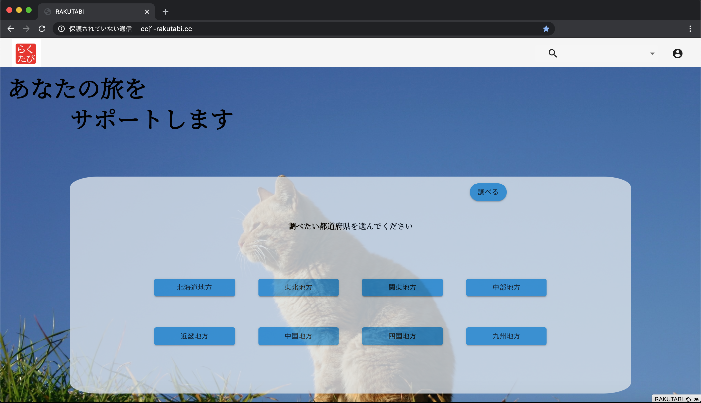

# 職務経歴書

## 基本情報

|      |                      |
| ---- | -------------------- |
| Name | 小川　翔 (Ogawa Sho) |

## 職務経歴

### CodeChysalis日本語イマーシブ受講生 (2020/05 ~ 2020/07)

  - JavaScriptを中心にフロントエンドからバックエンドまで幅広く学習する
    + NodeJS、Expressを用いたサーバーの構築
    + Expressを用いたRESTfulAPIの構築
    + React、Vueを用いたフロントエンドUIの構築
  - 短期間でフルスタックWebアプリの開発
    + 2日間でNodeJS、Express、React、Knex、Postgresを用いた体調管理Webアプリを開発
  - SpotifyAPIを用いたWebアプリの開発
    + 3 日間でSpotifyAPIについて学習し、Webアプリを開発、Herokuにデプロイした
  - 短期間でPythonを学習し、アプリを開発
    + 1週間でPythonを学習し、ライブラリを用いたゲームを開発した
  - 最終プロジェクトではバックエンドエンジニアとしてAWSを用いたWebアプリの環境構築を行う
    + EC2インスタンスの立ち上げ、仮想サーバー環境の構築
    + CodeDeployを用いたGitHubと連携した自動デプロイ環境の構築
    + CodePilepineを用いた継続的インテグレーション環境の構築
    + SystemManagerのParameterStoreをを用いた環境変数の管理
    + NGINXを用いたリバースプロキシ環境の構築

### 職業訓練 （2019/05 - 2019/07）

  - エンジニアへのキャリアチェンジの第1歩として職業訓練でC#の学習を通じてプログラミングの基礎を学ぶ。
  - 卒業と前後して技術力を更に高めたいと考え、プログラミングスクールに通うことを決意。数あるスクールの中から最も厳しいが最も実力がつくと思われるCodeChysalisに申し込むことを決意、入学試験のために独学でJavaScriptの勉強を始める。その後入学試験を突破し、CodeChrysalisの日本語イマーシブ講座を受講する。

### 株式会社三洋商店 (2016/10 - 2019/01)

#### 経理業務

  - 担当業務
    + 各事業部の経費精算、月次決算作成、年次決算作成業務に従事する。

  - 実績
    + 従来紙台帳で行っていた作業を電子化することによる業務の効率化を行う。エクセルの関数、マクロを用いたテンプレート作成により、入力補助、集計自動化などを行うことで作業時間を最大で8時間から1時間への短縮することに成功する。

#### インターネット通信販売事業

  - 担当業務
    + 売上管理、購入者との連絡、入金管理、発送管理

  - 実績
    + 売上発生から発送までの一連の管理業務の業務効率化を行う。一連の業務を精査し従来紙台帳、手書き書類で行っていた業務を電子化することで一日当たりの作業時間を最大で6時間削減することに成功する。

### 大学卒業後

  - 大学卒業前より体調を崩してしまい、就職活動に専念することが困難となったため、就職活動を断念。大学卒業後は実家にて静養を優先する。その間、塾講師として中学生の受験指導に従事する。国語、数学、社会を中心に教え、志望校合格につなげる。

## スキル

### プログラミング

  - フロントエンド言語
    + JavaScript
    + HTML
    + CSS
    + Python

  - フロントエンド フレームワーク/ライブラリ
    + [React](https://ja.reactjs.org/)
    + [Redux](https://redux.js.org/)
    + [Vue](https://jp.vuejs.org/index.html)

  - サーバサイド開発
    + [NodeJS](https://nodejs.org/ja/)
    + [Express](https://expressjs.com)

  - データベース
    + [Postgres](https://www.postgresql.org/)
    + [Knex](http://knexjs.org/)

  - インフラ構築
    + [AWS VPC](https://aws.amazon.com/jp/vpc/)
    + [AWS EC2](https://aws.amazon.com/jp/ec2/)
    + [AWS CodeDeploy](https://aws.amazon.com/jp/codedeploy/)
    + [AWS CodePipeline](https://aws.amazon.com/jp/ecodepypeline/)
    + [AWS Certificate Maneger](https://aws.amazon.com/jp/certificate-manager/)
    + [AWS Systems Manager](https://aws.amazon.com/jp/systems-manager/)

  - テストフレームワーク
    + [Mocha](https://mochajs.org/)
    + [Jasmine](https://jasmine.github.io/)

  - ゲームライブラリ
    + [pygame](https://www.pygame.org/news)

### その他

  - CI/CD
    + (Heroku Pipeline、AWS CodeDEploy / CodePipeline)
  - TDD
  - ペアプログラミング
    + ([VSCode LiveShare](https://visualstudio.microsoft.com/ja/services/live-share/))
  - アジャイル開発

## 言語

  - 日本語
    + ネイティブ
  - 英語
    + かんたんな日常会話ができる
    + TOEIC : 810点

## やったことはないが興味があるもの

  - [React Router](https://reactrouter.com/)
  - [React Native](https://reactnative.dev/)
  - [React BootStrap](https://react-bootstrap.github.io/)
  - [Material UI](https://material-ui.com/)
  - [Docker](https://www.docker.com/)
  - [ServerLess Framework](https://www.serverless.com/)
  - モバイルアプリ開発(Swift、Dart、Xamarin)
  - ディープラーニング
  - 公開鍵暗号
  - ブロックチェーン

## ポートフォリオ

  - [らくたび](http://ccj1-rakutabi.cc)
    + [GitHub](https://github.com/ccj1-senior-project/ccj1-senior-project)

  - アプリの概要
    + 地域を指定するとその地域の代表的な観光スポットがGoogle Map上で表示されます。複数の観光スポットを選択するとGoogle Map上で最適なルートが表示され、旅行計画の作成をサポートします。

  - 担当範囲
    CodeChrysalisの最終プロジェクトで5人チーム、3週間で開発しました。私はバックエンドエンジニアとしてAWS上でのアプリの実行環境の構築を担当しました。

    + AWSEC2を利用したWebアプリ実行環境構築
      * EC2仮想サーバーを作成し、その上でNextJSアプリを実行する環境を整えました。NextJSは3000番ポートでListenする為、Nginxをリバースプロキシサーバーとして導入し、httpで80番ポートに対してアクセスされた場合、自動的に3000番に振り返るよう設定しました。
    + AWS CodeDeploy、CodePipelineを利用したGitHubと連携したCI/CD環境の構築
      * CodeDeployを利用することでGitHubからのコードのデプロイを可能にしました。デプロイ時に更新前のアプリ停止、ファイルの削除/更新などを自動的に実行されるよう環境を整えました。またCodePipelineも併用することでGitHubのリポジトリが更新されるとWebHookで検知し、常に最新のコードがEC2上にデプロイ、実行されるようCI/CD環境を構築しました。これによりコーディング以外に要する時間と手間を削減することに成功しました。
    + AWS Sysmtem　ManagerのParametorStoreを利用した環境変数の管理、CI/CDプロセス中での環境変数の更新、適用
      * APIアクセスキー等の環境変数をAWS SystemManagerのParamettorStoreで管理しました。CodeDeploy、CodePipelineによるCI/CDの過程でParametorStoreから最新の環境変数が読み込まれ、環境変数を自動更新されます。これにより環境変数の一元管理と自動適用させることに成功しました。

  - テックスタック
    + NextJS、React、Redux、Material UI、JavaScript、AWS(VPC、EC2、CodeDeploy、CodePipeline、Lambda、API GateWay、DynamoDB、Cognito)、Rakuten Rapid API、Google Map API

  - [Hooked](https://spotify-project-beta.herokuapp.com/)
    + [GitHub](https://github.com/ccj1-spotify-project/spotify-project)

  - アプリの概要
    Spotify APIを利用した楽曲検索支援Webアプリケーション。国別、年代別の人気曲TOP50とそれぞれの曲のアーティストの検索、曲の視聴もできます。

  - 担当範囲
    CoceChrysalisのプロジェクトの一環で作成したアプリです。それまで触れたのことのないSpotifyAPIを利用し、3日間で作成しました。5人チームでの作成で私はバックエンドを担当しました。

    + SpotifyAPIを利用した人気の曲を取得するバックエンドメソッドの作成
      SpotifyAPIを利用してSpotifyで人気のアーティスト、アルバム、曲を取得するバックエンドメソッドを作成しました。Spotifyが公開している人気曲をまとめたプレイリストからプレイリストのカバー画像、それぞれの曲のアーティスト、アルバム、曲のIDを取得しました。また対象のプレイリストを変更することで地域別、年代別のプレイリストから情報を取得することができるようになり、人気曲もそれに準じた方で提供できるようになりました。

    + APIから情報を取得するバックエンド処理の実装
      APIを通じてプレイリストか人気曲とそのアーティストの情報を取得するバックエンドメソッドを実装しました。対象のプレイリストから含まれる曲、及びその曲のアーティスト情報を出力するメソッドを実装しました。プレイリストのIDを渡すことでそのプレイリストに含まれる曲、アーティストの情報を取得し、再利用しやすい形で出力することを意識しました。

  - テックスタック
    + React、JavaScript、Material UI、Spotify API

  - Do you like SPAM ?
    + [GitHub](https://github.com/linus-sh/spam-game)

  - アプリの概要
    Pythonで作成したゲーム。制限時間内にSPAM缶の画像をクリックしてクリックした回数がスコアになります

  - 担当範囲
    CodeChrysalisのプロジェクトで作成したアプリです。1週間(実質5日未満)で触れたことのない言語をを学んでアプリを作成するプロジェクトで作成しました。

    + 最初の2日でまずPythonの基本を学習し、残りの期間で作成しました。短い期間で学習し、アプリを作成らなければならなかったので短時間で効果的に、最低限のことのみを学習してアプリの制作に取り組むよう時間配分には気を使いました。
    + プログラミング言語Pythonの語源になったイギリスのコメディグループ、MontyPythonにちなんで彼らの名コント、SPAMを模して作成しました。

  - テックスタック
    Python、pygame

  - BackGroundColorChanger
    + [GitHub](https://github.com/linus-sh/BackGroundColorChanger)

  - アプリの概要
    GoogleChrome向け拡張機能。GoogleChromeで現在開いているタブの背景色を変更できるブラウザ拡張機能

  - 担当範囲
    ソロプロジェクト

  - テックスタック
    HTML、CSS、JavaScript

## 課外活動

### 登壇歴

  - CodeChrysalis BigMiniConf(2020/06/26)
    + ブラウザ拡張機能
      * [YouTube](https://www.youtube.com/watch?v=fhKgdzXkQeM)(33:00〜)

  - CodeChrysalis DemoDay(2020/07/23)
    + [YouTube](https://www.youtube.com/watch?v=aUhk2Wzb8Hk)
      * (38:10〜 個人プロジェクト)
      * (55:30〜 最終プロジェクト)

## 自己PR

<!-- 今まで -->

前職では、主に経理業務に携わっていました。業務の遂行においては常に業務の最適化、効率化を意識して取り組んできました。その結果、エクセルの関数、マクロを用いたテンプレート作成により、入力補助、集計自動化などを行うことで最大8時間要していた作業が1時間で完了できるようになりました。

また一時期携わっていたインターネット通信販売事業部においても、売上管理業務の業務効率化を行いました。従来紙帳簿で売上、入金、発送状態を管理していたところ、用いていたインターネット通信販売サイトのシステムに管理業務を統合。極力紙を廃止し、従来手書きで行っていた業務をシステム化することで一日辺りの作業時間を最大で6時間削減することに成功しました。

定例、定型業務が多いバックオフィス業務ではなく、スピード感のある、世界の最先端に触れられる仕事をしたいと考えエンジニアへのキャリアチェンジを決意、退職しました。

コーディングテストを突破してCodeChrisalis日本語イマーシブに参加。JavaScriptを軸としてReactやReduxといったフロントエンド技術、NodeJSやExpress等のバックエンド技術を学び、Webアプリをフルスッタックで作成できるようになりました。

<!-- 自信があること -->

AWSでの環境構築には誰よりも取り組んできました。CodeChrysalisの最終プロジェクトではアプリのインフラ環境の構築を一手に引き受けました。AWS EC2インスタンスの構築、CodeDeploy、CodePipelineを利用しGitHubと連携したCI/CD環境を構築しました。
またAWS SystemManagerのParameterStoreを用いて環境変数の管理も行い、CI/CDの過程で環境変数を自動的に更新するよう環境構築しました。

<!-- これからやりたいこと -->

学んできた技術を生かしてフルスタックで、特にバックエンド、インフラサイドに力を入れたいと考えています。
　現在はTypeScriptの学習を進めています。これまで学んできたJavaScriptのフルスタック技術を更に発展させたいと考えています。Golangにも興味があるのでこちらも習得したいと考えています。
　またCodeChrysalis最終プロジェクトでAWSを用いてインフラを構築した経験も活かしたいと考えていおり、AWS ソリューションアーキテクトを取得したいと考えています。
　ServerlessFrameworkやDockerといったサーバーレス、コンテナ技術にも興味があるのでAWS FargateやESC等と組み合わせてフルスタックアプリケーションを作成したみたいです。
